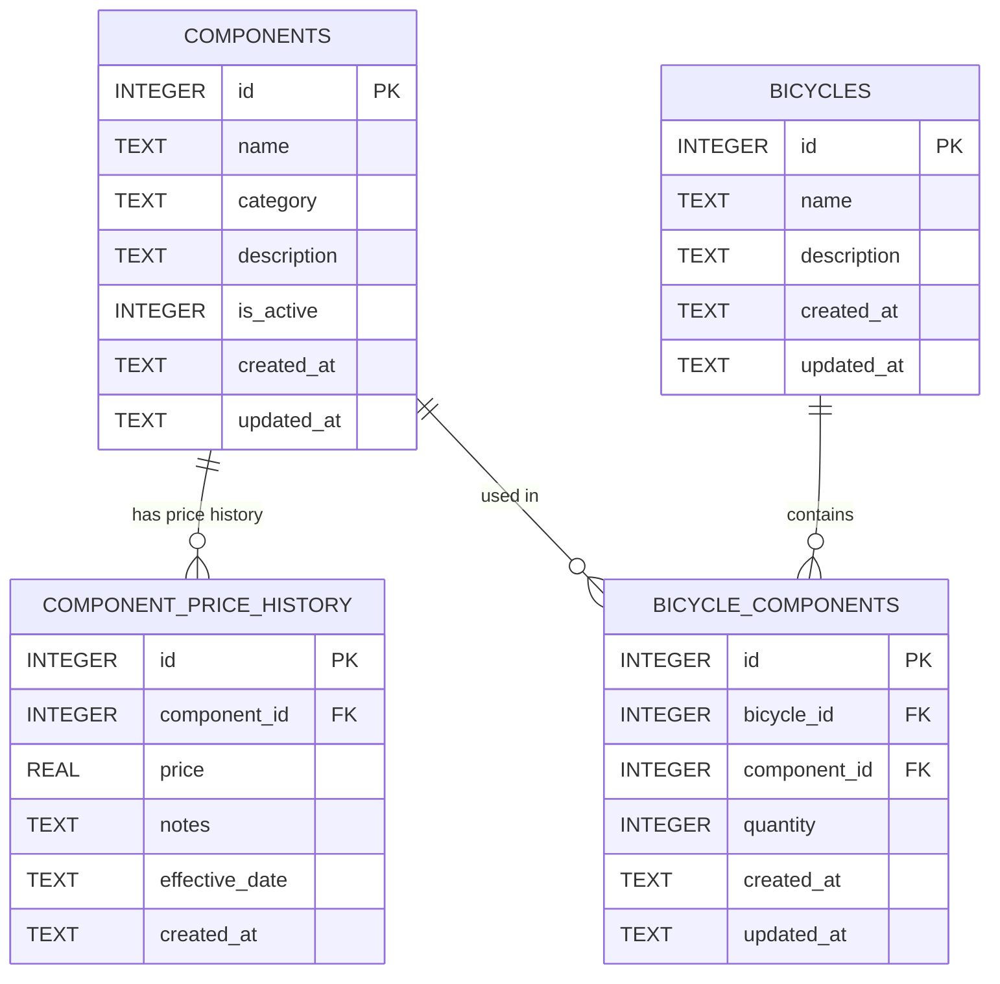

# Solution Design

## 1. System Architecture

```
┌─────────────────────────────────────────────────────────────────┐
│                         Browser                                 │
│  ┌─────────────────────────────────────────────────────────┐   │
│  │  React SPA  (localhost:3000)                            │   │
│  │  Pages: Dashboard │ Components │ Bicycles │ Pricing     │   │
│  └──────────────────────┬──────────────────────────────────┘   │
└─────────────────────────┼───────────────────────────────────────┘
                          │ HTTP/JSON (Axios)
                          ▼
┌─────────────────────────────────────────────────────────────────┐
│  Express.js Backend  (localhost:5000)                           │
│                                                                 │
│  ┌──────────┐  ┌─────────────┐  ┌──────────┐  ┌───────────┐  │
│  │  Routes  │→ │ Controllers │→ │ Services │→ │  Repos    │  │
│  └──────────┘  └─────────────┘  └──────────┘  └─────┬─────┘  │
│                                                       │        │
│  Middleware: errorHandler, validateRequest            │        │
└──────────────────────────────────────────────────────┼─────────┘
                                                        │ better-sqlite3
                                                        ▼
                                          ┌─────────────────────┐
                                          │   SQLite Database    │
                                          │   hero_cycles.db     │
                                          └─────────────────────┘
```

---

## 2. Layer Responsibilities

| Layer | File Location | Responsibility |
|---|---|---|
| Routes | `backend/routes/` | URL mapping only. No logic. |
| Controllers | `backend/controllers/` | Parse HTTP request, call service, format response. |
| Services | `backend/services/` | Business logic: validation, orchestration, pricing. |
| Repositories | `backend/repositories/` | All SQL queries. No business logic. |
| Middleware | `backend/middleware/` | Error handling, request logging. |
| Database | `backend/database/` | Schema, migrations, seed, connection. |
| Utils | `backend/utils/` | Pure helper functions (formatting, validation). |

**Why this structure?**  
Each layer has one job. You can swap SQLite for PostgreSQL by changing only the repository files. You can test services with mock repos. Controllers stay thin — they never touch SQL.

---

## 3. Data Flow: Calculate Bicycle Price

```
GET /api/bicycles/:id/pricing
         │
         ▼
BicycleController.getPricing(req, res)
         │
         ▼
PricingService.calculatePrice(bicycleId)
    │
    ├── BicycleRepository.findById(id)           → verify bicycle exists
    ├── BicycleComponentRepository.findByBicycle(id) → get components + quantities
    │
    └── for each component:
            PriceRepository.getLatestPrice(componentId)
            → { unit_price, effective_date }
    │
    ├── compute line_total = unit_price × quantity
    ├── accumulate grand_total
    └── build breakdown array
         │
         ▼
    return {
      bicycle, components: [...breakdown], grand_total,
      missing_prices: [...]   // components with no price
    }
         │
         ▼
Controller formats → 200 JSON response
```

---

## 4. ER Diagram



---

## 5. API Architecture

### Base URL
```
http://localhost:5000/api
```

### Endpoint Map

```
Components
  GET    /components                  List all active components with current price
  POST   /components                  Create component
  GET    /components/:id              Get single component with price history
  PUT    /components/:id              Update component metadata
  DELETE /components/:id              Soft-delete component

Price History
  GET    /components/:id/prices       Get price history for a component
  POST   /components/:id/prices       Add new price entry

Bicycles
  GET    /bicycles                    List all bicycles with total price
  POST   /bicycles                    Create bicycle
  GET    /bicycles/:id                Get bicycle with components
  PUT    /bicycles/:id                Update bicycle metadata
  DELETE /bicycles/:id                Delete bicycle

Bicycle Components
  POST   /bicycles/:id/components     Add/update component in bicycle
  PUT    /bicycles/:id/components/:componentId   Update quantity
  DELETE /bicycles/:id/components/:componentId   Remove component

Pricing
  GET    /bicycles/:id/pricing        Full pricing breakdown

Dashboard
  GET    /dashboard                   Stats + recent activity
```

### Standard Response Shapes

```json
// Success
{ "data": { ... }, "message": "Component created" }

// List
{ "data": [ ... ], "count": 12 }

// Error
{ "error": "Component not found", "code": "NOT_FOUND", "status": 404 }
```

---

## 6. Frontend Architecture

```
src/
├── components/          Reusable UI atoms
│   ├── Navbar.jsx
│   ├── StatCard.jsx
│   ├── PageHeader.jsx
│   ├── Modal.jsx
│   ├── Toast.jsx
│   ├── EmptyState.jsx
│   ├── LoadingSpinner.jsx
│   ├── ConfirmDialog.jsx
│   └── PriceTag.jsx
│
├── pages/               One file per route
│   ├── Dashboard.jsx
│   ├── Components.jsx
│   ├── PriceHistory.jsx
│   ├── Bicycles.jsx
│   ├── BicycleBuilder.jsx
│   ├── PricingBreakdown.jsx
│   └── NotFound.jsx
│
├── services/
│   └── api.js           All Axios calls in one place
│
├── hooks/
│   ├── useToast.js      Toast notification state
│   └── useConfirm.js    Confirmation dialog state
│
├── utils/
│   └── format.js        Currency, date formatters
│
└── styles/
    └── global.css       Design tokens + global styles
```

---

## 7. Folder Structure (Full)

```
hero-cycles/
├── docs/
│   ├── problem-analysis.md
│   ├── questions.md
│   ├── assumptions.md
│   ├── design.md           ← this file
│   ├── database.md
│   ├── pseudocode.md
│   ├── testing.md
│   └── interview-prep.md
│
├── prompts/
│   └── ai-prompts.md
│
├── backend/
│   ├── routes/
│   ├── controllers/
│   ├── services/
│   ├── repositories/
│   ├── middleware/
│   ├── database/
│   ├── utils/
│   ├── tests/
│   ├── app.js
│   ├── server.js
│   └── package.json
│
├── frontend/
│   ├── public/
│   ├── src/
│   └── package.json
│
└── README.md
```
